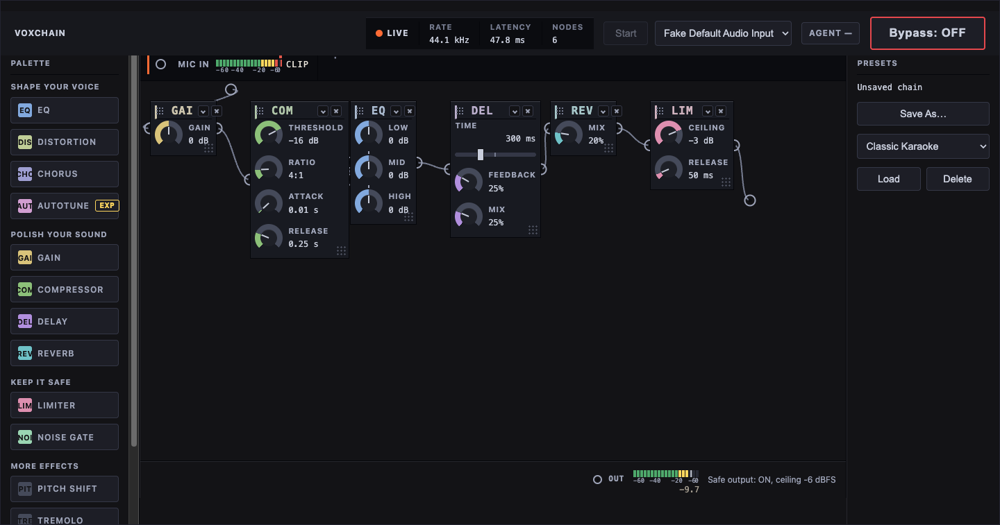

# VOXCHAIN

**Live: <https://voxchain.arrangedgodly.com/>**

A live vocal chain in your browser for karaoke, streaming, games, and voice experiments: mic in → 14 effects → your output. Nothing to install, no account, no cloud — the whole engine runs on your machine, and an AI agent in the browser can build and edit the chain from plain language via [WebMCP](https://developer.chrome.com/docs/ai/webmcp).



## Features

- **14 effects** — gain, compressor, EQ, delay, reverb, limiter, noise gate, distortion, chorus, autotune, pitch shift, tremolo, bitcrusher, and phaser — arranged in a left-to-right chain you control.
- **Two views** — **Simple** for picking a sound from a filterable library; **Advanced** for building the chain by hand.
- **33 factory presets** — from Classic Karaoke and Warm Ballad to Robot Usher and Hiss Rescue, with room for your own.
- **Plain-language agent control** — a ChatGPT/Codex in-app browser can build and tune the chain while you watch, with a plain-English summary and one-click **Undo** on every change.
- **A safety floor** — the limiter always stays last, a fixed output ceiling and feedback watchdog are always on, and the emergency **Bypass** (button or spacebar) is yours alone.
- **No install, no build** — static files; the local start scripts use only Python's built-in web server.

## Quickstart

**On the live site:**

1. Open **https://voxchain.arrangedgodly.com/** in Chrome.
2. Press **Start** in the top bar and allow microphone access when the browser asks.
3. Try sounds from the library — or switch to **Advanced** and build your own chain.

**From this repo:**

1. Clone or download it.
2. Double-click `start.bat` (Windows) or `start.command` (macOS). On the first run macOS may block the script — right-click it and choose **Open**.
3. Your browser opens at `http://localhost:8000` — press **Start** and allow the mic. If you have more than one microphone, pick it from the dropdown next to Start.

The only local requirement is Python (free from [python.org/downloads](https://www.python.org/downloads/); on Windows, tick "Add Python to PATH" during install). See [Running a live show](#running-a-live-show) for full operator notes.

## Two views

**Simple** (the default) is for choosing a sound, not building one. A stage names the **current sound** with **Previous/Next** buttons stepping through the library; filter chips (**All, Warm, Big echo, Funny, Clean & clear**) and a search box narrow it — the search reads each sound's name, description, and tags, so words the chips don't carry ("robot", "deep") still find their sounds. Every factory and saved preset is a card — click one to try it. What Simple never hides: **Start/Stop**, the mic picker, **Bypass**, and the input/output meters.

**Advanced** is the hands-on builder:

- The **Effects** panel under the board holds the 14 effects. **Click a chip to add it** — new effects land just before the limiter so it stays last — or drag one onto the board to place it exactly where you want it. The board reads left to right, mic in at the left end and safe out at the right, with a chevron drawn between adjacent cards; the signal-order strip under the board spells out the whole path.
- **Reorder by dragging** — pick a card up by its grip rail and drop it at a new slot in the row. A dashed placeholder previews the landing, the sound changes only when the drop completes, and **Escape** puts the card back with nothing changed. Prefer keys? Focus a card's grip and press **Alt+Left/Alt+Right** to walk it through the chain.
- **Resize a card** by dragging the machined corner at its bottom-right. Resizing never changes your sound, and saved widths come back with your chain.
- **IN** on a card bypasses that one effect (it shows **BYP**; click again to return it). **×** removes a card; the chevron collapses its controls while the effect keeps working.
- **Nothing you do by hand is a one-way door.** Every structural edit you make — adding, moving, or removing an effect, or trying a sound — pops a small card at the bottom-right naming the edit ("Add Reverb") with an **Undo** key. **Ctrl/Cmd+Z** (Windows/Mac) takes the same steps back from the keyboard, one edit at a time, long after the card is gone.
- Meters on the **MIC IN** and **OUT** strips show live levels — one strip above the row, one below — and both stay put even when the chain is longer than the screen.

Switch views from the top bar any time; your choice is remembered.

## The effects

| Effect | What it does |
| --- | --- |
| Gain | Sets the level feeding the chain. |
| Compressor | Evens out loudness between quiet and loud singing. |
| EQ | Low, mid, and high tone shaping. |
| Delay | Echo, from short slap-back to longer repeats. |
| Reverb | Room ambience, from a tight space to a cathedral. |
| Limiter | Caps the output level; always the last node in every chain. |
| Noise Gate | Mutes the mic between phrases — built for noisy rooms. |
| Distortion | Grit and edge, from light warmth to a full roar. |
| Chorus | Thickens and widens the voice with two drifting copies of it. |
| Autotune | Pulls each note toward the key and scale you pick. |
| Pitch Shift | Moves the voice up or down in semitones. |
| Tremolo | Volume wobble at an adjustable rate and depth. |
| Bitcrusher | Lo-fi digital grunge by reducing the bit depth. |
| Phaser | A slow, spacey sweep of filter notches. |

A few honest notes:

- **Noise Gate** defaults are gentle. If it chops the ends off words, lengthen **Release**.
- **Distortion** has no perfectly clean zero — Drive at 0 still colors the sound slightly. For a clean comparison, use **Bypass**.
- **Autotune** carries an **Experimental** badge and adds a fixed 20 ms delay (a fiftieth of a second) — expected behavior, not a fault. Pick the song's actual key; a wrong key gives the classic wrong-key robot sound (which is a choice, if you mean it). **Retune Speed** runs from instant hard-tune snap to a gentle glide.
- **Pitch Shift** covers ±12 semitones but stays most intelligible within about ±7.
- **Chorus** and **Phaser** are stereo effects — they show best on headphones or a stereo PA.

## Presets

The app ships with **33 factory presets** grouped by what you're doing: cleanup first (Hiss Rescue, Room Announcer), then performance, speech and hosting, genres, vibes, and gag sounds (Robot Usher, Chipmunk Party, Dark Helmet Baritone…). They're load-only starting points — try them from Simple, or use the **Presets** panel in Advanced.

Once you have a sound you like, **Save As…** stores it under your own name (including each effect's IN/BYP state). Bring one back with a click in the searchable preset list — factory sounds grouped by category, then **Yours** below them; each of your own sounds carries a **Delete** (click twice — the first click asks "Confirm delete" and backs off if you change your mind or wait five seconds). Your chain also **autosaves** as you go, so if the app closes by accident, reopening picks up right where you left off.

## Agent control

The app registers ten tools with the browser using **WebMCP** — no MCP server, package, manifest, API key, or browser extension. A supported ChatGPT or Codex in-app browser discovers them automatically while the page is open, and you can then work the app in plain language while manual control stays available at all times.

The fastest way to see it:

1. Open **https://voxchain.arrangedgodly.com/** in the ChatGPT (or Codex) in-app browser and press **Start**.
2. Ask: *"Set up a warm ballad vocal with light reverb."* Watch the chain rebuild itself, with a plain-English summary toast and a one-click **Undo**.
3. Ask for something unsafe: *"Remove the limiter."* The app refuses, shows what was asked versus what's allowed, and the limiter stays.

**No agent handy?** Open the site with **`?dev`** — an **Agent Harness** panel appears where you can run all ten tools directly with example inputs. Start with `get_capabilities`, then `set_chain` (prefilled with a valid example), then hit Undo.

<details>
<summary>Optional Chrome diagnostics</summary>

Useful for development, not required for the in-app-browser path above:

1. Go to `chrome://flags/#enable-webmcp-testing`, set it to **Enabled**, restart Chrome, and open the app.
2. DevTools (**F12**) → **Application** → **WebMCP** lists the ten tools and lets you run any of them by hand.
3. Optionally install the **Model Context Tool Inspector** extension to exercise the tools through a development agent.

</details>

**Under the hood**, agents and humans drive the same chain through one shared mutation path: [`src/mcp-tools.js`](src/mcp-tools.js) defines the ten tools and their safety policy, [`src/chain-editing.js`](src/chain-editing.js) is the single mutation interface shared by human gestures, agent edits, preset loads, and Undo, and [`src/mcp-server.js`](src/mcp-server.js) is the small in-page registration adapter. The app itself is **LLM-free** — no API keys, no cloud calls; it supplies the audio vocabulary and enforces the safety contract, and all the intelligence runs in the agent's (or your) hands.

## Safety: who controls what

**You can do everything:** build, reorder, tune, bypass effects, save presets, start and stop the engine, pick the mic, hit emergency Bypass.

**An agent can:** read the chain, presets, and capabilities; add, remove, and reorder effects and set parameters within published safety limits; retrieve, load, and save presets.

**An agent cannot:**

- Touch the red emergency **Bypass** — it works from the button or the **spacebar**, always.
- Start or stop the engine, or pick the microphone.
- Edit anything before you press Start — mutations are refused with a stable `ENGINE_NOT_STARTED` result until the engine is live (reads work any time).

**Hard invariants, for everyone:**

- Every chain keeps its **limiter** as the terminal node — removal requests are refused.
- A fixed **−6 dBFS host attenuator** (output ceiling) is always on and not adjustable.
- A **watchdog** mutes the output if something starts to howl — restoring it is human-only.
- Every agent mutation gets a change-summary toast with one-click **Undo** — and so does every structural edit you make yourself (add, move, remove, or trying a sound). **Ctrl/Cmd+Z** reaches the same shared undo stack at any time, whoever made the edit.

## The ten tools

Registered by the app for in-browser agents:

| Tool | Kind | What it does |
| --- | --- | --- |
| `get_capabilities` | read | Policy ranges, or a sound-design guide mapping plain-language goals ("warm", "lo-fi", "robotic"…) to safe effect settings. |
| `get_chain` | read | The live chain in the exact shape `set_chain` accepts. |
| `set_chain` | write | Replace the whole chain in one validated pass. |
| `add_node` | write | Insert one effect node (position optional). |
| `remove_node` | write | Remove one node — refused if it breaks a chain rule. |
| `set_param` | write | Set one parameter, ramped smoothly where the platform allows. |
| `list_presets` | read | The factory library plus your saved presets. |
| `get_preset` | read | One preset's full chain, without loading it. |
| `load_preset` | write | Load a listed preset as the live chain, with summary toast and Undo. |
| `save_preset` | write | Save the current chain as a named preset. |

## Running a live show

The app is the same deployed or local — this section is about getting it onto the laptop at the venue, which may have no internet.

**Before the event:**

- Use the laptop's **Chrome** browser (other browsers haven't been tested).
- Plug in the mic and speakers/PA before starting.
- Python only needs to be present for the start script; if it's missing, the script says so — install it free from [python.org/downloads](https://www.python.org/downloads/).

**Starting up:**

1. Double-click `start.bat` (Windows) or `start.command` (Mac). If macOS says "permission denied," run `chmod +x start.command` on it once (drag the file into Terminal after typing `chmod +x `), then double-click again.
2. Press **Start** and allow microphone access; pick the right mic from the dropdown if there's more than one.

> [!NOTE]
> Keep the terminal window the start script opened running in the background — closing it shuts the app down. If the browser doesn't open by itself, go to `http://localhost:8000`.

**Start becomes Stop while running.** Pressing **Stop** releases the microphone and silences all output, including Bypass and effect tails; **Start** resumes with the same sound and layout, including edits that could not autosave. An autosave warning stays visible until a save succeeds — those edits won't survive a page reload. The status strip across the top shows **Stopped/Live** plus sample rate, latency, and how many effects are in the chain.

> [!WARNING]
> **If anything sounds wrong, hit Bypass first and investigate later.** The big red **Bypass** button (top right) — or just the **spacebar** — instantly cuts every effect and sends the raw, clean mic straight through. Hit it again to bring your chain back. Better a plain mic than a bad sound in front of a room full of people.

**If something's not working:**

- **No sound:** check the mic dropdown and that the browser got mic permission (camera/mic icon in the address bar).
- **Browser didn't open:** open Chrome and go to `http://localhost:8000`.
- **"Python not found":** see the Python note above.
- **Still stuck:** hit Bypass so the show goes on with a clean mic, and sort it out at the break.

## Development

```sh
git clone https://github.com/ArtofFish/voxchain.git
cd voxchain
npm test
```

The test suite has zero dependencies — Node alone, from a clean clone — and CI runs it on every pull request. Vendored third-party pieces (Tone.js, the reverb impulse response, the test vocal) and their licenses are listed in [THIRD_PARTY_NOTICES.md](THIRD_PARTY_NOTICES.md).
