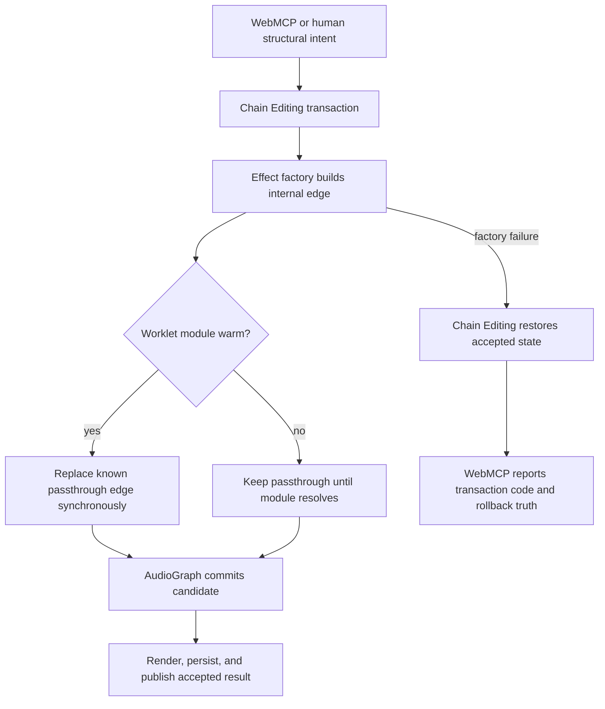

# Warm Worklet Structural Edits - Plan

## Goal Capsule

- **Objective:** A live VOXCHAIN session can load a sound or add a worklet-backed effect after its worklet module is warm, without rejecting the edit or losing agreement between the sound, board, autosave, and WebMCP result.
- **Means:** Make each worklet factory splice only an edge it created, and translate transaction failures by their real runtime class instead of labeling them as argument validation faults. See KTD1 and KTD3.
- **Authority:** Chain Editing remains the accepted-edit and rollback authority. AudioGraph remains the live topology authority. Effect factories own their internal worklet splice. WebMCP owns tool result translation.
- **Execution profile:** Test first against strict Web Audio doubles, then make the smallest factory and adapter changes.
- **Stop conditions:** Stop if the fix would require a public tool input-schema change, a Chain Editing bypass, weaker rollback, a terminal limiter exception, or agent control over Start, Stop, Bypass, microphone choice, or output restoration.
- **Tail ownership:** Complete verification, commit the reviewed files, push a feature branch, and open a pull request. Do not merge or deploy.

---

## Product Contract

### Summary

Fix warm-cache construction for Noise Gate and Autotune, preserve the existing structural transaction, and return an honest WebMCP runtime failure if any chain apply still fails.

### Problem Frame

On 2026-09-03, `load_preset` for Studio Polish and a later `add_node` for Noise Gate failed during a live Yeti X session. Both returned `SCHEMA_LAYER_FAULT` with a browser `AudioNode.disconnect(destination)` error. Chain Editing restored Classic Karaoke each time. Parameter-only edits and structural edits that did not create a warm worklet-backed node continued to succeed.

The worklet factories copied a cold-start splice into a warm-cache path. The cold path connects `inputGain` directly to `outputSum` while `audioWorklet.addModule()` resolves. The warm path skips that connection but still calls the destination-specific disconnect. The Web Audio specification requires `InvalidAccessError` when that edge does not exist. The test doubles ignore the same invalid call, so existing second-instance coverage stays green.

### Requirements

**Worklet construction**

- R1. A new Noise Gate or Autotune instance must reach its worklet topology when the module is already loaded for the current `AudioContext`.
- R2. The cold path must remain an immediate unity passthrough until the module loads, then replace that internal edge with the worklet path.
- R3. The warm path must not expose a passthrough interval to the live chain and must never disconnect an edge the factory did not create.
- R4. Gate and Autotune must retain their parameter initialization, pending-parameter behavior, per-context module cache, disposal, and external stable connection points.

**Transaction and tool truth**

- R5. Every preset load, add, remove, reorder, and full-chain replacement must continue through Chain Editing. When rollback succeeds, a rejected structural edit must leave the previous accepted model, rendered board, live graph, preset state, autosave, and Undo history intact. When rollback fails, the result must preserve `CHAIN_ROLLBACK_FAILED` and explicitly warn that live and visible state may disagree, as defined by AE5.
- R6. WebMCP must reserve `INVALID_ARGUMENTS` and `SCHEMA_LAYER_FAULT` for input-validation and tool-layer failures. A rejected Chain Editing apply must report its existing `CHAIN_APPLY_FAILED` or `CHAIN_ROLLBACK_FAILED` class and rollback status.
- R7. A successful structural edit must preserve the terminal limiter rule and host output attenuator. It must not change Bypass or watchdog latch ownership.
- R8. Start, Stop, Bypass, microphone choice, and output restoration remain human-only.

**Evidence**

- R9. Regression coverage must use destination-strict AudioNode doubles that throw when `disconnect(destination)` names an absent edge.
- R10. Verification must cover a warmed Studio Polish load, a warmed gate add after an unrelated structural edit, Autotune's matching warm path, rollback truth, visible state agreement, the full Node suite, syntax checks, diff checks, and a real local Chrome run when available.
- R11. Automated browser evidence must remain separate from audible microphone, DSP, interface, and physical PA acceptance.

### Acceptance Examples

- AE1. Given a running Classic Karaoke chain and a Noise Gate module already loaded in the same audio context, when WebMCP loads Studio Polish, then the edit succeeds and the accepted, rendered, live, persisted, and reported chains contain Studio Polish with its terminal limiter.
- AE2. Given the same warm module state, when an unrelated reverb is added and removed before a Noise Gate is added at position 2, then all three structural edits succeed and no absent-destination disconnect occurs.
- AE3. Given a warm Autotune module, when a fresh Autotune node is added, then the new instance starts with the declared worklet topology and exactly one module load remains recorded for that context.
- AE4. Given a forced graph apply failure after valid arguments, when rollback succeeds, then WebMCP reports `CHAIN_APPLY_FAILED`, includes successful rollback status, and does not claim argument validation failed.
- AE5. Given a forced rollback failure, when WebMCP receives `CHAIN_ROLLBACK_FAILED`, then it preserves that code and warns that live and visible state may disagree.

### Scope Boundaries

This work includes the duplicated Gate and Autotune factory bug because they share the same faulty warm path. It includes WebMCP result translation because the deployed report obscured the runtime cause.

#### Deferred to Follow-Up Work

- Failed-startup recovery and layout persistence from issue #51 remain separate.
- The broader `mcp-tools.js` module split from issue #13 remains separate.
- Audible large-jump and physical PA acceptance from issue #5 remain human work after the code change.

This work does not redesign AudioGraph rewiring, Chain Editing transaction order, worklet DSP, Auto Gain behavior, preset content, or the public WebMCP input schemas.

### Sources and Research

- `src/node-gate.js` owns the Noise Gate cold and warm worklet splice. Studio Polish reaches it through `src/factory-library-data.js`.
- `src/node-autotune.js` contains the same splice pattern and needs the same regression boundary.
- `tests/test-gate-node.js` and `tests/test-autotune-node.js` already exercise second-instance construction, but their AudioNode doubles do not implement strict destination disconnect behavior.
- `src/chain-editing.js` already converts a failed structural apply into `CHAIN_APPLY_FAILED` or `CHAIN_ROLLBACK_FAILED` and records rollback truth.
- `src/mcp-tools.js` currently converts every rejected `ChainEditing.apply()` promise into `SCHEMA_LAYER_FAULT` and prefixes the reason with argument-validation text.
- Issue #20 and PR #23 established Chain Editing as the one mutation transaction and require browser-visible, live, persisted, and Undo state to agree.
- [Web Audio API 1.1, `AudioNode.disconnect(destinationNode)`](https://webaudio.github.io/web-audio-api/#dom-audionode-disconnect-destinationnode-output-input) requires `InvalidAccessError` when no connection exists to the named destination.

---

## Planning Contract

### Key Technical Decisions

- KTD1. **Create the temporary edge before either factory branch.** Both factories will connect the internal unity passthrough during construction. The warm branch will replace it synchronously before the factory returns, while the cold branch will keep it until module resolution. This gives `disconnect(destination)` a real edge in both paths and keeps the splice logic single-sourced.
- KTD2. **Make the existing Web Audio doubles enforce the platform contract.** Destination-specific disconnect will remove a present edge and throw for an absent edge. The warm second-instance scenarios then become deterministic regressions instead of permissive simulations.
- KTD3. **Translate known transaction failures without relabeling them.** The WebMCP mutation adapter will preserve `CHAIN_APPLY_FAILED` and `CHAIN_ROLLBACK_FAILED`, include rollback truth, and use runtime-specific reason and guidance. Unexpected validation or adapter crashes will still use `SCHEMA_LAYER_FAULT`.
- KTD4. **Leave Chain Editing and AudioGraph unchanged unless the failing regression contradicts the source trace.** Rollback succeeds because the factory throws before the new graph commits, then Chain Editing rebuilds the previously accepted model. An unrelated structural add succeeds when it does not create a warm Gate or Autotune instance.

### High-Level Technical Design

### Assumptions

- The deployed failure occurred after the Gate worklet module was warm in the current audio context. The deterministic strict-double regression will confirm this causal path before production code changes.
- Preserving the existing transaction error codes in WebMCP result values is compatible with the frozen tool names and input schemas. Tests will pin the result contract and keep `SCHEMA_LAYER_FAULT` for true adapter or validation-layer faults.

### System-Wide Impact

The change affects the agent and human paths only when they construct a fresh Gate or Autotune instance. The accepted state, terminal limiter, host attenuator, Bypass, watchdog latch, persistence, and Undo mechanisms keep their present owners. Review should reject any diff that weakens those boundaries to make the regression pass.

### Risks and Mitigations

- A blanket try/catch around the illegal disconnect could hide another topology error. KTD1 prevents the invalid state instead of suppressing it.
- A permissive test double could let the same bug return. KTD2 makes the platform's strict behavior part of the shared fixture contract.
- Changing every unexpected mutation rejection to a transaction code could hide a real tool-layer defect. KTD3 maps only the two known Chain Editing codes.
- Fixing Gate alone would leave Autotune exposed. The two factory tests and browser scenario cover both copied paths.

---

## Implementation Units

### U1. Pin destination-strict warm worklet construction

- **Goal:** Reproduce the missing-edge disconnect deterministically for Gate and Autotune.
- **Requirements:** R1-R4, R9, R10; covers AE1-AE3.
- **Dependencies:** None.
- **Files:** `tests/test-gate-node.js`, `tests/test-autotune-node.js`, `tests/test-regression-cycle3.js`
- **Approach:** Update each local AudioNode double so destination-specific disconnect follows the Web Audio contract. Keep blanket disconnect behavior unchanged. Extend the existing cached-module second-instance cases to prove a fresh warm instance constructs one worklet, creates no extra module load, removes its passthrough edge, and leaves the expected internal worklet topology.
- **Execution note:** Run the new warm-instance cases before editing the factories and record the expected `InvalidAccessError` failure.
- **Patterns to follow:** Existing per-context cache and second-instance checks in both test files.
- **Test scenarios:**
  1. Disconnecting a connected named destination removes only that edge.
  2. Disconnecting an absent named destination throws a strict platform-shaped error.
  3. A second Gate on a loaded context reaches `input -> worklet -> output` with one total module load.
  4. A second Autotune on a loaded context reaches the same internal topology with one total module load.
  5. A new audio context still follows the cold module-load path rather than reusing another context's cache.
  6. The real WebMCP, Chain Editing, and AudioGraph path accepts fresh warm Gate and Autotune instances after removal, with matching accepted, rendered, live, persisted, and Undo state and a terminal limiter.
- **Verification:** Both focused tests fail for the current warm path for the intended reason, then pass after U2 without weakening strict disconnect behavior.

### U2. Repair the duplicated factory splice

- **Goal:** Make Gate and Autotune warm and cold construction valid under strict Web Audio behavior.
- **Requirements:** R1-R4, R7, R8; covers AE1-AE3.
- **Dependencies:** U1.
- **Files:** `src/node-gate.js`, `src/node-autotune.js`, `tests/test-gate-node.js`, `tests/test-autotune-node.js`
- **Approach:** Establish the unity passthrough edge before choosing the warm or cold branch. Reuse the existing insert routine to replace that known edge. Keep external inputs and outputs disconnected from the live chain until AudioGraph commits the candidate. Retain the current disposed guard for Gate and add no new ownership to Chain Editing or AudioGraph.
- **Patterns to follow:** The documented synchronous factory contract and stable composite connection points in the two node modules.
- **Test scenarios:**
  1. A cold factory is usable as unity passthrough before module resolution and becomes a worklet after resolution.
  2. A warm factory completes synchronously without a temporary external live path or exception.
  3. Initial and pending parameters arrive on the created worklet unchanged.
  4. Module rejection leaves the cold instance as its documented unity passthrough.
  5. Noise Gate disposal before cold module resolution retains its existing guard against late insertion and leaked subscriptions or worklet nodes. Autotune lifecycle changes remain outside this splice repair.
- **Verification:** The focused Gate and Autotune suites pass with strict doubles, and the production source has no guarded suppression around the splice disconnect.

### U3. Correct WebMCP transaction failure classification

- **Goal:** Report structural apply and rollback failures as transaction failures while preserving true schema-layer faults.
- **Requirements:** R5-R8, R10; covers AE4 and AE5.
- **Dependencies:** U1.
- **Files:** `src/mcp-tools.js`, `tests/test-submission-hardening.js`, `tests/test-abort-signal.js`
- **Approach:** Add a narrow result builder for known Chain Editing rejection codes. Preserve the tool name, reason, rollback fields, and fail-closed guidance. Keep unexpected validator, planner, missing-dependency, and adapter exceptions on `SCHEMA_LAYER_FAULT`. Keep abort and engine-not-started precedence unchanged.
- **Patterns to follow:** Existing result-value behavior in `mutationExecute`, Chain Editing's error codes, and the truthful rollback guidance already asserted by submission-hardening tests.
- **Test scenarios:**
  1. `CHAIN_APPLY_FAILED` with successful rollback returns that code, names an apply failure, and confirms the prior chain was restored.
  2. `CHAIN_ROLLBACK_FAILED` remains higher priority than a late abort and warns that state may be split.
  3. A validator throw still returns `SCHEMA_LAYER_FAULT` with argument-validation wording.
  4. A missing Chain Editing dependency still returns `SCHEMA_LAYER_FAULT` without mutating state.
  5. `ENGINE_NOT_STARTED`, `ABORTED`, policy refusals, and valid successes retain their current results.
- **Verification:** Focused WebMCP suites pin the distinct classes and rollback fields without changing any tool input schema.

### U4. Verify the live structural sequence and repository gate

- **Goal:** Prove the complete reported sequence in the real browser runtime when local Chrome is available and catch unrelated regressions before publication.
- **Requirements:** R5-R11; covers AE1-AE5.
- **Dependencies:** U2, U3.
- **Files:** `tests/browser-probe.js`, `tests/run.js`, `scripts/build-static.js`
- **Approach:** Use a temporary browser-probe expression against a locally served static build. Start with the fake microphone, warm the Gate worklet, restore Classic Karaoke, load Studio Polish, add and remove reverb, add Gate at position 2, and compare Chain Editing, Canvas, AudioGraph, persistence, preset state, and tool results after each accepted edit. Confirm Bypass and the terminal limiter remain unchanged. Do not commit the temporary expression unless it exposes reusable coverage missing from the Node suites.
- **Test scenarios:**
  1. The locally served build loads with no page, console, or network failure.
  2. The warmed Studio Polish load succeeds and all observable chain representations agree.
  3. Reverb add and remove followed by a warmed Gate add succeeds without a disconnect exception.
  4. A warmed Autotune add succeeds in Chrome.
  5. Human Bypass state and terminal limiter policy survive every structural edit.
- **Verification:** Focused regressions, the full zero-dependency Node suite, `node --check` for changed JavaScript, `git diff --check`, and static build all pass. The local Chrome probe must pass when available; otherwise record it as unverified with the concrete blocker. Record browser automation separately from unperformed audible and physical checks.

---

## Verification Contract

| Gate | Command | Required result | Units |
| --- | --- | --- | --- |
| Gate regression | `node tests/test-gate-node.js` | Warm and cold construction pass under strict disconnect behavior | U1, U2 |
| Autotune regression | `node tests/test-autotune-node.js` | Warm and cold construction pass under strict disconnect behavior | U1, U2 |
| Structural integration | `node tests/test-regression-cycle3.js` | Warm fresh-node edits pass through the real shared transaction with aligned state | U1, U2 |
| WebMCP classification | `node tests/test-submission-hardening.js` and `node tests/test-abort-signal.js` | Transaction codes and schema faults stay distinct | U3 |
| Full regression | `node tests/run.js` | Every discovered `tests/test-*.js` file passes with zero failed checks | U1-U4 |
| Syntax | `node --check` on every changed JavaScript file | No syntax errors | U1-U3 |
| Diff hygiene | `git diff --check` | No whitespace errors | U1-U4 |
| Static build | `npm run build` | Static artifact builds successfully | U4 |
| Browser QA | `node tests/browser-probe.js` against the local static server and a temporary expression | When local Chrome is available, the reported live sequence succeeds with aligned state and no browser failures; otherwise record the blocker and unverified status | U4 |

Audible microphone behavior, gate quality, worklet latency, USB interface behavior, and PA output require a later human acceptance pass with the intended hardware. A green automated browser probe does not satisfy those checks.

---

## Definition of Done

- U1 demonstrates the current defect before the factory change and passes afterward with destination-strict doubles.
- U2 fixes both copied warm paths without changing the public node model, DSP, terminal limiter, or human safety controls.
- U3 distinguishes transaction failures from schema-layer faults and preserves abort, engine, policy, and missing-dependency behavior.
- U4 records passing focused tests, full suite, syntax, diff, and build evidence, plus a passing local Chrome probe when available or its explicit blocker and unverified status.
- The accepted model, rendered board, live graph, persisted chain, preset state, and Undo history stay consistent through the browser sequence.
- No experimental or abandoned code remains in the diff.
- The commit contains only the plan and fix-owned files.
- A pull request targets the current upstream default branch with the requested review sections and residual physical-audio risks. The branch is not merged or deployed.
